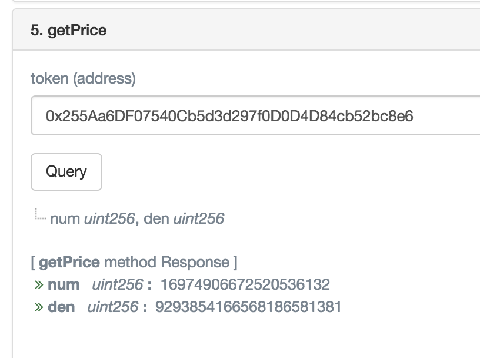
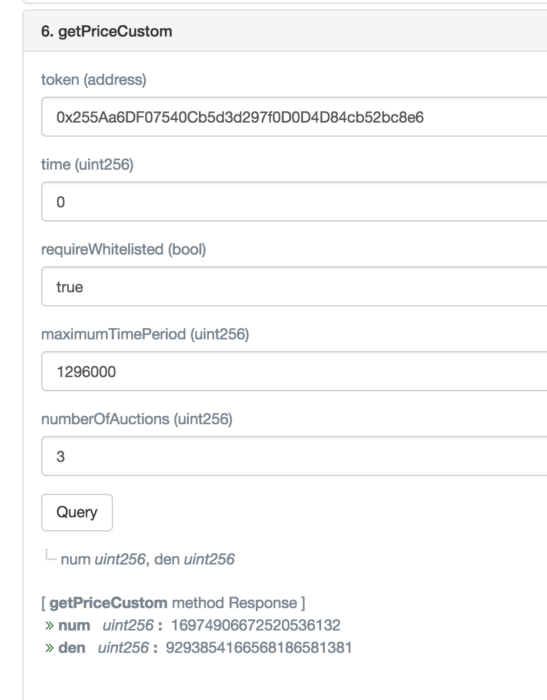

[](https://travis-ci.com/gnosis/dx-price-oracle)

<p align="center">
  <a href="./docs/audit_report/Solidified_Audit_Report.pdf">
  
  </a>
</p>

# DutchX Price Oracle

Contract to get an onchain reliable price oracle from DutchX protocol.

The oracle exposes a simple function that will return the price for any ERC20 
traded on the DutchX ([See implementation](https://github.com/gnosis/dx-price-oracle/blob/master/contracts/DutchXPriceOracle.sol#L27)).
```js
function getPrice(address token)
        public
        view
        returns (uint num, uint den)
```


This function will return a fraction (`num`/`den`), using the following logic:
* `0/0`: 
  * If the token it's not listed in DutchX
  * If the token it's not whitelisted in the DutchX
  * If there's not enough liquidity. Basically, it requires that there should be 
    auctions running continuosly in the DutchX. More formally, it will return 
    `0/0` if there is less than **9 auctions** in the last **4.5 days**.
* `num/den`: **Median of the last 9 auctions**. In other words, if we order the 
  last 9 auctions by price, we take the 5th value.



It provides also a parametrized function, to allow to change the behaviour of the
price oracle ([See implementation](https://github.com/gnosis/dx-price-oracle/blob/master/contracts/DutchXPriceOracle.sol#L43)):
```js
function getPriceCustom(
        address token,
        uint time,
        bool requireWhitelisted,
        uint maximumTimePeriod,
        uint numberOfAuctions
    )
        public
        view
        returns (uint num, uint den)
```

Note: the contract is only safe for odd numbers of auctions. See [here](https://github.com/gnosis/dx-price-oracle/blob/master/contracts/DutchXPriceOracle.sol#L165).

The next image shows an example, on how to get the price using:
* RDN Token: `0x255Aa6DF07540Cb5d3d297f0D0D4D84cb52bc8e6`
* Check the current price: `0`
* Return only prices for whitelisted tokens: `true`
* Return only a price if the auctions runned within the last **1.5 days**: `1296000`
* Use **3 auctions** to get the median: `3`


# Deployed price oracle
Rinkeby:
* **DutchXPriceOracle**: [https://rinkeby.etherscan.io/address/0x98650dc1D7a76Cc0c3B8AbCA2cA31DCd04DF62A3 ](https://rinkeby.etherscan.io/address/0x98650dc1D7a76Cc0c3B8AbCA2cA31DCd04DF62A3)

Mainnet: 
* **DutchXPriceOracle**: [https://etherscan.io/address/0x764c0020706575ebbdEa3C425EBF894C4F855B07](https://etherscan.io/address/0x764c0020706575ebbdEa3C425EBF894C4F855B07)

## Local development
```bash
# Install dependencies
yarn install

# Compile contracts and inject network info
yarn restore

# Print the network info for every contract
yarn networks
```

## Migrate contracts
For a local ganache:
```bash
# Run ganache
npx ganache-cli

# Migrate
yarn migrate
```

For other networks:
```bash
# Rinkeby
PK=<private_key> yarn migrate --network rinkeby

# Mainnet
PK=<private_key> yarn migrate --network mainnet
```

## Create a new version
```bash
# Generate version and tag it
npm version <new-version-number>

# Publish version into git
git push && git push --tags

# Publish version into npm
npm publish --access=public
```

## Validate the contract
```bash
# Flatten contract
npx truffle-flattener contracts/DutchXPriceOracle.sol > build/DutchXPriceOracle-EtherScan.sol
npx truffle-flattener contracts/WhitelistPriceOracle.sol > build/WhitelistPriceOracle-EtherScan.sol
```

Validate the contract:
* [https://etherscan.io/verifyContract2](https://etherscan.io/verifyContract2)

## Tests

Tests use a [mock contract](https://github.com/gnosis/mock-contract) to imitate the behavior of the DutchX. We generate 50 auctions with random prices and clearing times, and then test each contract fn on that model.

The recommended ways to run the tests is:

`npx truffle test`

or 

`npx truffle test --log` (to get console logs)

Have fun!
