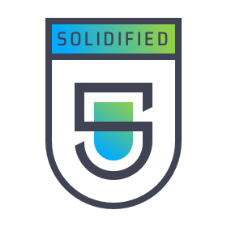

[](https://travis-ci.com/gnosis/dx-price-oracle)

<p align="center">
  <a href="./docs/audit_report/Solidified_Audit_Report.pdf">
  
  </a>
</p>

# DutchX Price Oracle

Contract to get reliable price oracle from DutchX protocol.

Currently, uses a mock-interface (in `./contracts/IDutchX.sol`) of the DutchX in order for Solidity to be happy.

But it uses the actual abi for the tests. This is imported in `./contracts/Imports.sol`.

## Local development
```bash
# Install dependencies
yarn install

# Compile contracts and inject network info
yarn restore

# Print the network info for every contract
yarn networks
```

## Migrate contracts
For a local ganache:
```bash
# Run ganache
npx ganache-cli

# Migrate
yarn migrate
```

For other networks:
```bash
# Rinkeby
PK=<private_key> yarn migrate --network rinkeby

# Mainnet
PK=<private_key> yarn migrate --network mainnet
```

## Create a new version
```bash
# Generate version and tag it
npm version <new-version-number>

# Publish version into git
git push && git push --tags

# Publish version into npm
npm publish --access=public
```

## Validate the contract
```bash
# Flatten contract
npx truffle-flattener contracts/DutchXPriceOracle.sol > build/DutchXPriceOracle-EtherScan.sol
```

Validate the contract:
* [https://etherscan.io/verifyContract2](https://etherscan.io/verifyContract2)

## Tests

Tests use a [mock contract](https://github.com/gnosis/mock-contract) to imitate the behavior of the DutchX. We generate 50 auctions with random prices and clearing times, and then test each contract fn on that model.

The recommended ways to run the tests is:

`npx truffle test`

or 

`npx truffle test --log` (to get console logs)

Have fun!
